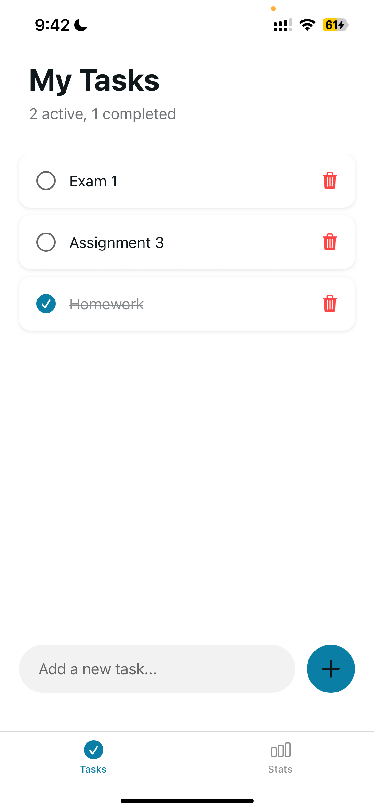
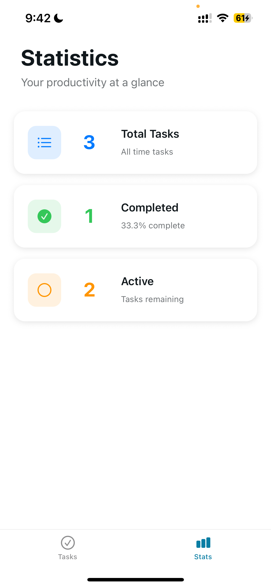

# Task Manager App

A clean and intuitive Task Manager app built with React Native and Expo that allows users to efficiently manage their daily tasks.

## Features

### Core Functionality
- **Add Tasks**: Create new tasks with descriptive text
- **Mark Complete**: Toggle tasks between complete and incomplete states
- **Delete Tasks**: Remove tasks from your list
- **Task List**: View all tasks in an organized, scrollable list

### Enhanced Features
- **Statistics Dashboard**: Real-time tracking of task completion metrics
- **Dark/Light Mode**: Automatic theme switching based on system preferences

## Screenshots

The app features two main screens:
- **Tasks Tab**: Main task management interface with add/complete/delete functionality
- **Stats Tab**: Analytics showing total tasks, completed tasks, active tasks, and completion percentage

| Task Tab | Stats Tab |
|------------|-----------|
|  |  |

## Tech Stack

- **React Native**: Cross-platform mobile development framework
- **Expo**: Development platform and toolchain
- **TypeScript**: Type-safe JavaScript development

## Getting Started

### Prerequisites
- Node.js (14 or newer)
- npm or yarn
- Expo CLI (optional, but recommended)
- iOS Simulator or Android Emulator (for testing)

### Installation

1. **Clone the repository**
   ```bash
   git clone <your-repository-url>
   cd taskmanagerapp
   ```

2. **Install dependencies**
   ```bash
   npm install
   ```

3. **Start the development server**
   ```bash
   npx expo start
   ```

4. **Run on your platform**
   - Install Expo Go app and scan the QR code

## Project Structure

```
taskmanagerapp/
├── app/
│   ├── (tabs)/
│   │   ├── index.tsx          # Main tasks screen
│   │   ├── stats.tsx          # Statistics screen
│   │   └── _layout.tsx        # Tab navigation layout
│   ├── _layout.tsx            # Root layout with providers
│   ├── +not-found.tsx         # 404 error screen
│   └── tasks-context.tsx      # Global state management
├── assets/
│   └── fonts/
├── components/
├── constants/
├── hooks/
└── package.json
```

## Future Enhancements

Potential features for future versions:
- Task categories and filtering
- Due dates and reminders
- Data persistence with AsyncStorage
- Task search functionality
- Export/import task lists
- Custom themes and colors
